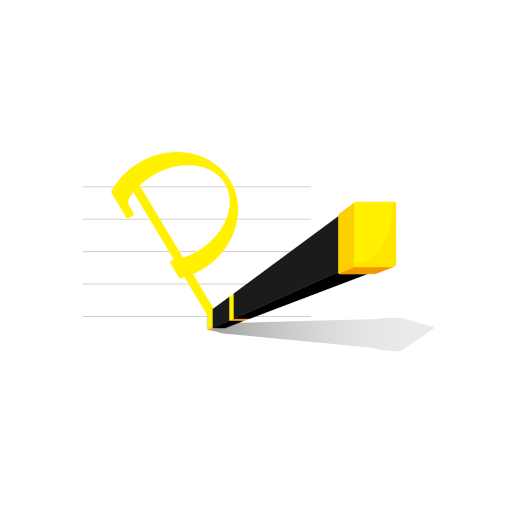

**Pen Power**
===
## Requirement
***
* Dart 3.24.2
* Flutter 2.2.3
## Dependencies
***
* [provider](https://pub.dev/packages/provider): ^5.0.0
* [image_picker](https://pub.dev/packages/image_picker): ^0.8.0
* [path](https://pub.dev/packages/path): ^1.8.0
* [flutter_colorpicker](https://pub.dev/packages/flutter_colorpicker): <=0.4.0
* [image](https://pub.dev/packages/image): ^3.0.2
* [path_provider](https://pub.dev/packages/path_provider): ^2.0.2
* [tuple](https://pub.dev/packages/tuple): ^2.0.0
* [sqflite](https://pub.dev/packages/sqflite): ^2.0.0+3
* [device_info](https://pub.dev/packages/device_info): ^2.0.2
* [intl](https://pub.dev/packages/intl): ^0.17.0
* [dots_indicator](https://pub.dev/packages/dots_indicator): ^2.0.0
* [package_info](package_info): ^2.0.2
* [wakelock](https://pub.dev/packages/wakelock): ^0.5.2

## LICENSE
***
Pen Power © 2021 is licensed under the 3-Clause BSD license
